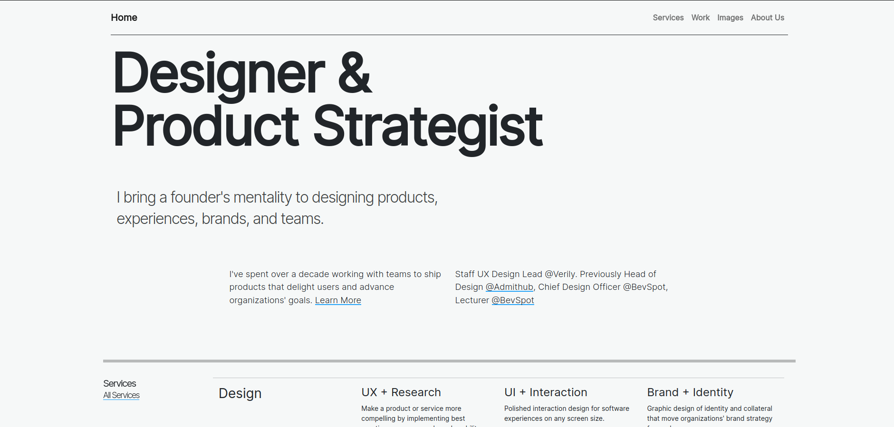

# single-page-application

- A single-page application (SPA) is a web application or website that interacts with the user by dynamically rewriting the current web page with new data from the web server, instead of the default method of a web browser loading entire new pages.
- The goal is faster transitions that make the website feel more like a native app.
- In a SPA, a page refresh never occurs.
- This website is an example of SPA, that means, on clicking any link for a section, the website isn't refreshed and directly scrolls to that section.
- In this website, there are 5 sections : Home, Services, Work, Images and About.

---

## Tech Stack

- The website is built with famous web development tools, they are mentioned below:
  

  ***

## Screenshot

---

## Sections

**1.Home:**

- The landing page of the website.

**2.Services:**

- Contains the services provides by the developer and team.

**3.Work:**

- Contains some of the work done by the developer with images and case study.

**4.Images:**

- Contains carousel of some random images.

**5.About Us:**

- Contains details about developer.
